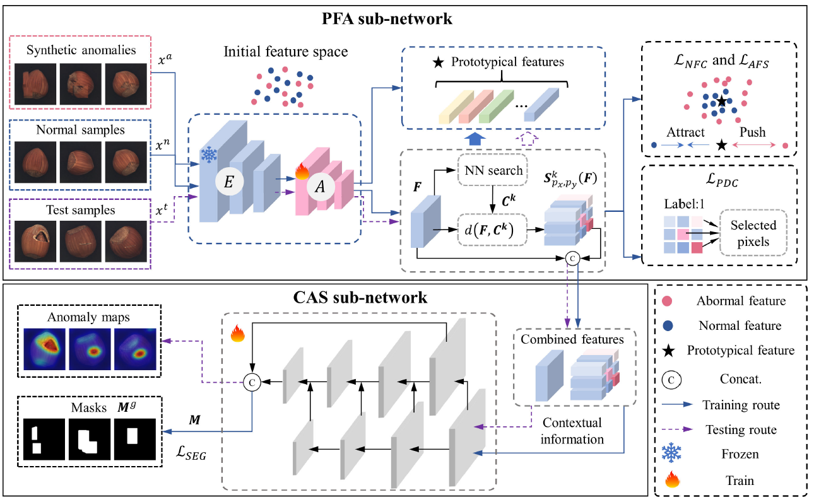

<div align="left">
<br>
<br>
</div>
<div align="center">
<h1>PCSNet: Prototypical Learning Guided Context-Aware Segmentation Network for Few-Shot Anomaly Detection</h1>
<div>
&nbsp;&nbsp;&nbsp;&nbsp;Yuxin Jiang<sup>1</sup>&emsp;
&nbsp;&nbsp;&nbsp;&nbsp;Yunkang Cao<sup>1 </sup>&emsp;
&nbsp;&nbsp;&nbsp;&nbsp;Weiming Shen<sup>1, *</sup>&emsp;
</div>
<div>
&nbsp;&nbsp;&nbsp;&nbsp;<sup>1</sup>Huazhong University of Science and Technology
</div>
  
[[Paper]](https://ieeexplore.ieee.org/document/10702559/)
  




---

</div>

>**Abstract:** Few-shot anomaly detection (FSAD) denotes the identification of anomalies within a target category with a limited number of normal samples. While pre-trained feature representations play an important role in existing FSAD methods, there exists a domain gap between pre-trained representations and target FSAD scenarios. This study proposes a Prototypical Learning Guided Context-Aware Segmentation Network (PCSNet) to address the domain gap and improve feature descriptiveness in target scenarios. In particular, PCSNet comprises a prototypical feature adaption (PFA) sub-network and a context-aware segmentation (CAS) sub-network. PFA extracts prototypical features as accurate guidance to ensure better feature compactness for normal data while distinct separation from anomalies. A pixel-level disparity classification loss is also designed to make subtle anomalies more distinguishable. Then a CAS sub-network is introduced for pixel-level anomaly localization, where pseudo anomalies are exploited to facilitate the training process. Experimental results on MVTec and MPDD demonstrate the superior FSAD performance of PCSNet, with 94.9% and 80.2% image-level AUROC in an 8-shot scenario, respectively. Real-world applications on automotive plastic part inspection further demonstrate that PCSNet can achieve promising results with limited training samples.

**Index Terms:** Anomaly detection; Pretrained feature representations; Few-shot learning; Prototypical learning;

## 💻 Requirements
- pytorch == 1.12.0
- torchvision == 0.13.0
- numpy == 1.21.6
- scipy == 1.7.3
- matplotlib == 3.5.2
- tqdm

## 📥 Dataset
Download the MVTec dataset [here](https://www.mvtec.com/company/research/datasets/mvtec-ad).

## 🚀 Usage
Execute the following command for training and evaluation:
```bash
python main.py
```

## 📊 Results


## 🖼️ Visualization


## 📝 Citation
If you find this work useful, please consider citing:
```
@article{jiang2024prototypical,
  title={Prototypical learning guided context-aware segmentation network for few-shot anomaly detection},
  author={Jiang, Yuxin and Cao, Yunkang and Shen, Weiming},
  journal={IEEE Transactions on Neural Networks and Learning Systems},
  year={2024},
  publisher={IEEE}
}
```
